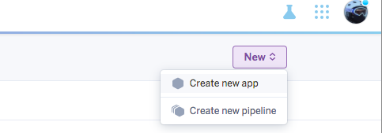
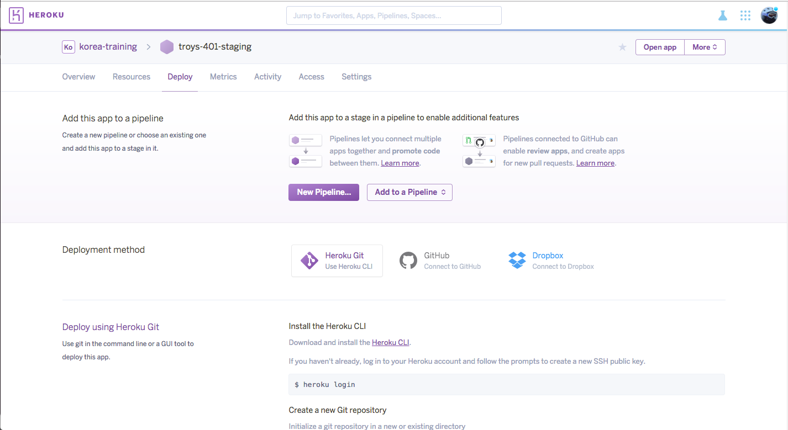
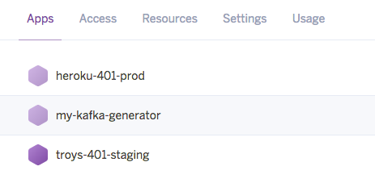

# Heroku 401 - Pipelines

For this exercise we are going to use another Java application to work with as we setup a build pipeline in Heroku. There are a few concepts that we need to explore in the platform as to how this works. 

## Prerequisites
If you don't have a Github account, you can set one up for free now as we are going to be using this for this exercise. 

Github is the source of events that our [Heroku Pipeline](https://devcenter.heroku.com/articles/pipelines) will be listening and the source of truth for our code. It is worthwhile to take a moment and have a look at the pipelines article as it explains a lot of concpets we are about to see. 

## app.json
You might have noticed in the code repositories so far that there is this interesting file called [app.json](https://devcenter.heroku.com/articles/app-json-schema)

This file is what describes to Heroku the characteristics of the application we are going to deploy, what addons and plans are required, any configuration variables it needs and a whole host of other intersting information. It is behind an awful lot of the automation that we are using when we deploy using a pipelines and Github.

## Setup a Staging and Production Application
So you want to grab your own copy of this repository for this exercise. On this page, you should see a "fork" button, this will copy into your own Github. 


We are going to do this a little differently now, let's head to the Heroku dashboard and on the top right find the "New" button and let's create a new app.



Excellent, now this time we are going to give it a bit of a more meaningful name as we want it to act as our staging application. 


Now open our app and it should be at the deploy tab. It is here that we connect our app to the codebase in our Github repository.



Connect to your repository and enable automatic deploys, I usually just use the master branch but your pipeline could be different.


Go ahead and click a manual deploy to get your code up and running on Heroku! You will see the now familiar build log as it builds and deploys.

Now go back to the home and create a new app just like before, only this time create an app with a label that you recognise as a production app. We don't need to configure anything else for this at the moment.



## Create the Pipeline
Select your staging application and navigate to the Deploy tab again, notice the option to create a new pipeline? Click that and name it something meaningful.


This will create the pipeline and take you to the screen where you define your flow for moving applications into production. Lets add our production app here now. 


We now have an empty, shell of an application that is awaiting a deploy to production and a fully functioning application that is our staging app. 

## Enable Review Apps and Tests
So there is a very cool feature in Heroku that allows automatic (or manual) creation of a thing called a [Review App](https://devcenter.heroku.com/articles/github-integration-review-apps). A Review App is created when the platform receives a Githook from a pull request that has been created, lets have a look at what that means. 

Firstly, time to grab your codebase. Remember, you want to grab the repository you have connected to your pipeline. 

```
> git clone https://github.com/ibigfoot/heroku-401.git
``` 


